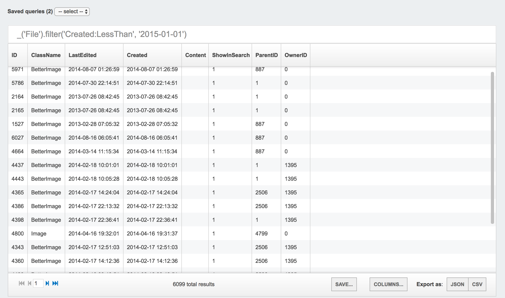

# SilverStripe SuperQuery

The power of raw queries, with the elegance of the ORM.

## Installation

`$ composer require unclecheese/sivlerstripe-superquery`

## Features

### Run queries from within the CMS using the ORM, or SQL.

Use the `_('YourClassName')` as a replacement for `YourClassName::get()`, and use [Symfony's
expression language](http://symfony.com/doc/current/components/expression_language.html) for the rest. (Spoiler: it's so dead simple, you already understand it).

**Examples:**

* `_('File').filter('Created:LessThan', '2015-01-01')`
* `_('Member').filter({'Email:PartialMatch': 'hotmail.com', 'Active': true).sort('Created DESC')`
* `_('Event').filter('Approved', true).relation('Sponsors').sort('CompanyName ASC')`
* `_('Event').filter('Approved', false).removeAll()`

### Choose which columns you want displayed

Click on the `Columns...` button in the footer to bring up a panel allowing you to customise the view.

### Export data to CSV or JSON

Click on the export buttons to export the data in its current state in JSON or CSV.

### Save frequently used queries

Click `Save...` to give the query a name and store it in the "saved queries" dropdown.

### Hang it anywhere

The API is decoupled from the CMS, meaning the tool can be installed anywhere in your project.

## Security

Needless to say, running raw queries against your database is serious business. All actions are restricted to `ADMIN`.

## Troubleshooting

Ring Uncle Cheese.